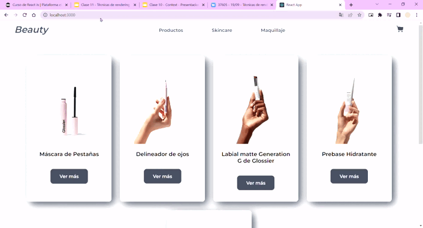

## Aquira: E-Commerce en React
Aquira es un ___e-commerce___ ficticio, que simula un emprendimiento de ventas de productos importados de belleza, para el Proyecto Final del curso de ___React Js___ de CoderHouse. Se utilizó React Hooks para el manejo de estados y para la navegación y enrutados, React Router Dom.

* [Demo de la página](https://aquira.netlify.app/)



## Características
* Carrito
* Catálogo de Compra
* Filtrado por productos

## Tecnologías, librerías e íconos
* React Js
* Hooks utilizados: useState, useEffect y useContext
* React Toastify
* Icons8
* Firebase

## Creación e Instalación:

Este proyecto se inició con [Create React App](https://github.com/facebook/create-react-app).

Para acceder al proyecto, deberás ejecutar en la consola:
````
$ git clone https://github.com/camyael/Proyecto-ReactJS.git
````

Para instalar las dependencias, en el directorio del proyecto ejecute: 
````
$ npm install 
$ npm start
````

La página se volverá a cargar cuando realice cambios.